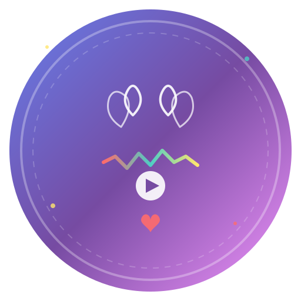

# 🎵 Just Feel Audio Editor Studio

<p align="center">
  
</p>

<p align="center">
  
  
  
</p>

<p align="center">
  <b>✨ Waaooo Kamal! Itna Simple, Itna Beautiful, Itna Powerful Audio Editor ✨</b>
</p>

---

## 🌟 **About Just Feel**

**Just Feel Audio Editor Studio** is a professional-grade, browser-based audio editing tool designed with simplicity and power in mind. Whether you're a podcaster, musician, content creator, or just someone who wants to edit audio, Just Feel provides everything you need with an interface so simple, even a nursery student can use it! 

### ❤️ **Why "Just Feel"?**

Because editing audio shouldn't be complicated. Just upload, feel the music, make your edits, and create magic! No complex menus, no technical jargon - just pure creativity flowing from your heart to your audio.

---

## ✨ **Features That Will Touch Your Heart**

### 🎤 **Core Features**
- **📂 Drag & Drop Upload** - Simply drag your audio file and drop it
- **🌊 Live Waveform Visualization** - See your audio come alive with beautiful animations
- **▶️ Smart Playback Controls** - Play, Pause, Stop with style
- **⏮️ Quick Skip** - Jump forward/backward 5 seconds instantly

### 🎛️ **Studio-Grade Controls**
- **🔊 Volume Control** (0% - 200%)
- **⚡ Speed Control** (0.5x - 2x)
- **🎹 Pitch Shifting** (-12 to +12 semitones)
- **✂️ Visual Trim Tool** - Cut your audio precisely

### 🎸 **Professional Effects**
- 🌟 **Reverb** - Add space and depth
- 🔄 **Echo/Delay** - Create atmospheric sounds
- ⚡ **Distortion** - Rock your audio!
- 🔽 **Low Pass Filter** - Smooth out high frequencies
- 🔼 **High Pass Filter** - Clean up low-end rumble

### 💾 **Export & Save**
- **WAV Format** - Lossless quality
- **MP3 Format** - Compressed format
- **Instant Download** - No waiting, no accounts

### 🎨 **Beautiful Design**
- **Gradient UI** - Eye-catching purple gradients
- **Animated Elements** - Everything moves beautifully
- **Celebration Effects** - Confetti on every achievement!
- **Responsive Design** - Works on mobile, tablet, and desktop
- **Dynamic Buttons** - Buttons that respond to your touch

### 🔧 **Advanced Features**
- **↩️ Undo/Redo** - Made a mistake? No problem!
- **Real-time Updates** - All changes reflect immediately
- **Offline Support** - No internet needed!

---

## 🚀 **Live Demo**

<p align="center">
  <a href="YOUR_GITHUB_LINK_HERE">
    
  </a>
</p>

> **Note:** Once you host on GitHub Pages, replace `YOUR_GITHUB_LINK_HERE` with your actual link!

---

## 📦 **Installation & Usage**

### Method 1: Direct Browser (Easiest!)
1. Download the `AudioEditor.html` file
2. Double-click to open in your browser
3. Start editing audio immediately!

### Method 2: Clone Repository
```bash
# Clone this beautiful project
git clone https://github.com/YOUR_USERNAME/just-feel-audio-editor.git

# Open the folder
cd just-feel-audio-editor

# Open in browser
open AudioEditor.html  # Mac
start AudioEditor.html  # Windows
